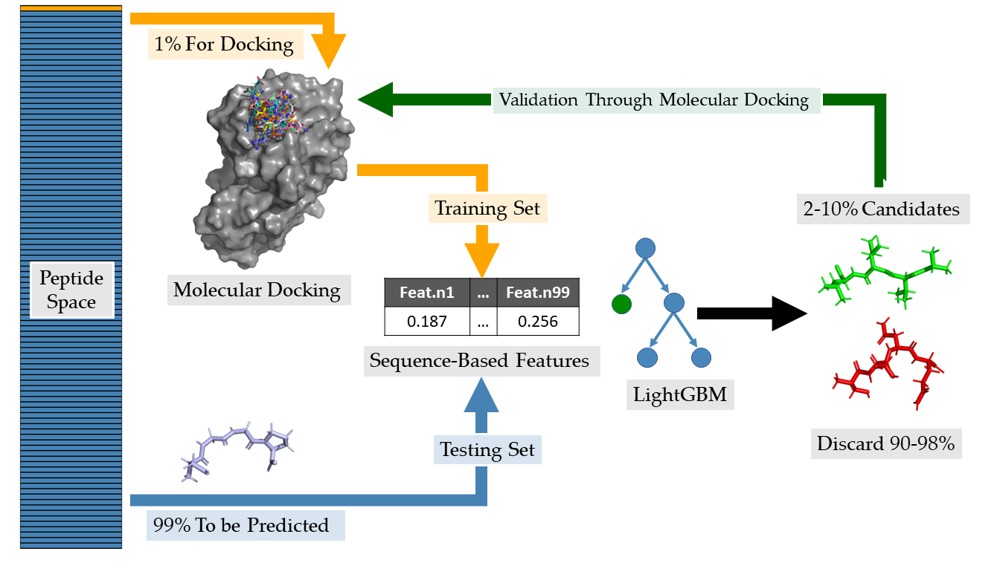

# Accelerating Peptide Screening: LightGBM & Molecular Docking Pipeline

[](https://www.mdpi.com/article/10.3390/ijms241512144)
[](https://creativecommons.org/licenses/by/4.0/)
[](https://www.r-project.org/)
[](https://lightgbm.readthedocs.io/)

## 📋 Overview

This repository contains the source code and datasets for the research article **"Accelerating the Screening of Small Peptide Ligands by Combining Peptide-Protein Docking and Machine Learning"**, published in the *International Journal of Molecular Sciences* (2023).

The project implements a **High-Throughput Virtual Screening (HTVS)** pipeline that couples molecular docking with **Light Gradient Boosting Machine (LightGBM)** algorithms. This approach addresses the computational bottleneck of screening massive peptide libraries, successfully reducing the processing time by a factor of **10 to 320-fold** while maintaining high accuracy in identifying top binder candidates.

### 🚀 Key Highlights
* **Machine Learning Integration:** Utilizes LightGBM for binary classification of peptide binding affinity, chosen for its superior speed (0.057 min) compared to Random Forest (326 min) and SVM.
* **Massive Library Screening:** Validated on a library of **160,000 tetrapeptides** against four viral targets (Chikungunya, Dengue, West Nile, and Zika).
* **Computational Efficiency:** Achieves **90-95% concurrence** with traditional full-docking methods while docking only a fraction of the library.
* **Software Agnostic:** The pipeline is validated using both commercial (**OpenEye**) and open-source (**AutoDockFR**, **AutoDock CrankPep**) docking suites.

## ⚙️ The Pipeline

The workflow employs a "Smart Screening" strategy to predict high-affinity binders without exhaustively simulating the entire chemical space:



1.  **Initial Sampling:** Perform molecular docking on a random **1% subset** of the peptide library.
2.  **Feature Extraction:** Extract **99 sequence-based physicochemical features** (e.g., Z-scales, Kidera factors, Cruciani properties) using the `Peptides` R package.
3.  **Model Training:** Train a **LightGBM** classifier to distinguish between "Better Performers" (Top 20%) and "Worse Performers".
4.  **Prediction:** Predict the probability of high-affinity binding for the remaining **99%** of the library.
5.  **Targeted Validation:** Select only the top candidates (2-10%) for validation docking, discarding the non-promising majority.

## 📊 Performance Metrics

The model demonstrates robust statistical performance across multiple viral datasets using **Bayesian Hyperparameter Optimization**.

| Metric | Performance (Avg) | Description |
| :--- | :--- | :--- |
| **AUC-ROC** | **0.84 - 0.91** | High discriminative ability between binders and non-binders. |
| **Accuracy** | **0.83 - 0.85** | Overall classification correctness. |
| **F1-Score** | **0.60 - 0.67** | Balanced precision and recall for imbalanced datasets. |
| **Specificity** | **0.86 - 0.88** | High capability to filter out false positives (poor binders). |

## 🛠️ Tech Stack & Dependencies

The core analysis is performed in **R**, with support scripts in **Python** for structure generation.

### R Dependencies
```r
install.packages(c(
  "lightgbm",              # Gradient Boosting Framework
  "Peptides",              # Physicochemical feature extraction
  "rBayesianOptimization", # Hyperparameter tuning
  "caret",                 # Machine Learning workflow
  "pROC",                  # ROC analysis
  "tidyverse",             # Data manipulation (dplyr, ggplot2)
  "data.table"             # Fast data handling
))
````


## 📜 Citation

If you use this code or methodology in your research, please cite the original article:

### AMA Style

Codina J-R, Mascini M, Dikici E, Deo SK, Daunert S. Accelerating the Screening of Small Peptide Ligands by Combining Peptide-Protein Docking and Machine Learning. International Journal of Molecular Sciences. 2023; 24(15):12144. https://doi.org/10.3390/ijms241512144

### BibTeX

@Article{ijms241512144,
AUTHOR = {Codina, Josep-Ramon and Mascini, Marcello and Dikici, Emre and Deo, Sapna K. and Daunert, Sylvia},
TITLE = {Accelerating the Screening of Small Peptide Ligands by Combining Peptide-Protein Docking and Machine Learning},
JOURNAL = {International Journal of Molecular Sciences},
VOLUME = {24},
YEAR = {2023},
NUMBER = {15},
ARTICLE-NUMBER = {12144},
URL = {https://www.mdpi.com/1422-0067/24/15/12144},
ISSN = {1422-0067},
ABSTRACT = {This research introduces a novel pipeline that couples machine learning (ML), and molecular docking for accelerating the process of small peptide ligand screening through the prediction of peptide-protein docking. Eight ML algorithms were analyzed for their potential. Notably, Light Gradient Boosting Machine (LightGBM), despite having comparable F1-score and accuracy to its counterparts, showcased superior computational efficiency. LightGBM was used to classify peptide-protein docking performance of the entire tetrapeptide library of 160,000 peptide ligands against four viral envelope proteins. The library was classified into two groups, &lsquo;better performers&rsquo; and &lsquo;worse performers&rsquo;. By training the LightGBM algorithm on just 1% of the tetrapeptide library, we successfully classified the remaining 99%with an accuracy range of 0.81&ndash;0.85 and an F1-score between 0.58&ndash;0.67. Three different molecular docking software were used to prove that the process is not software dependent. With an adjustable probability threshold (from 0.5 to 0.95), the process could be accelerated by a factor of at least 10-fold and still get 90&ndash;95% concurrence with the method without ML. This study validates the efficiency of machine learning coupled to molecular docking in rapidly identifying top peptides without relying on high-performance computing power, making it an effective tool for screening potential bioactive compounds.},
DOI = {10.3390/ijms241512144}
}

